<div align="center">


# JanSetu-Swachh

**Crowdsourced civic & sanitation issue reporting, segregation tracking and verified resolution**

Smart India Hackathon 2026 · Student Innovation · **SIH26195** · Clean &amp; Green Technology


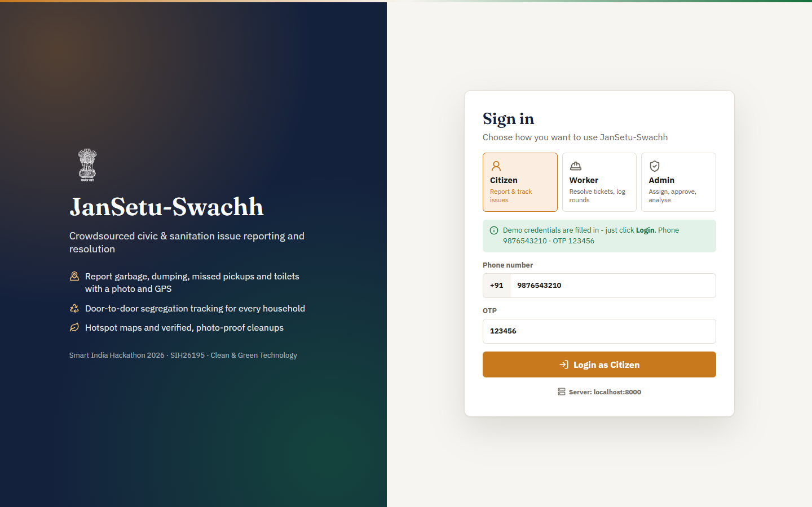

</div>

---

## Contents

- [The problem](#the-problem)
- [What JanSetu-Swachh does](#what-jansetu-swachh-does)
- [Try the demo](#try-the-demo)
- [Screenshots](#screenshots)
- [Architecture](#architecture)
- [Repository structure](#repository-structure)
- [Getting started](#getting-started)
- [Downloads](#downloads)
- [API overview](#api-overview)
- [Testing](#testing)
- [Team](#team)

## The problem

Cities lose the fight against garbage in the gaps between people: a citizen sees a dumping spot but doesn't know whom to tell, a complaint is closed without the spot ever being cleaned, and nobody knows which households hand over mixed waste. The **Solid Waste Management Rules, 2026** make four-stream segregation at source (wet, dry, sanitary, special care) mandatory, but there is no simple way to track it door to door.

JanSetu-Swachh closes that loop: **report → auto-route → assign → geo-tagged photo proof → officer approval → citizen confirmation**, plus household-level segregation tracking and hotspot analytics for the sanitation department.

## What JanSetu-Swachh does

### Citizen (Android app + web portal)
- Report garbage piles, dumping spots, missed door-to-door pickups, mixed waste, waste burning and dirty/locked public toilets (plus sewage, water leaks and potholes) with a photo and GPS location.
- AI suggests the issue type from the photo; the report is auto-routed to the right department with an SLA (e.g. waste burning: 12 h).
- Track every ticket, see the worker's "after" photo, and confirm the fix or reopen it.
- **Which Bin?** — searchable four-stream segregation guide (works offline in the app).
- **Swachh points** and levels for genuine reports and verified fixes.

### Sanitation worker (Android app + web portal)
- See assigned tickets, navigate to the spot, start work, and close it with a geo-tagged "after" photo.
- **Door-to-door collection round** — log each household as segregated / partly segregated / mixed / no waste / locked.

### Admin (web portal + Windows desktop app)
- Live ticket queue with filters, worker assignment (capacity-aware), proof review and approval.
- SLA-overdue badges and a "needs attention" queue.
- **Swachh Insights** — garbage hotspot map (recurring complaints within 150 m), ward-wise segregation compliance, households needing follow-up, clearance time and within-SLA rate.

## Try the demo

Start the backend and web portal ([Getting started](#getting-started)), open the portal, pick a login type and click **Login** — the demo credentials are pre-filled.

| Login type | Credentials |
|---|---|
| Citizen | Phone `9876543210` · OTP `123456` (any phone number works with OTP `123456`) |
| Worker | Employee ID `DEMO-WORKER` · Password `Demo@123` (Solid Waste department) |
| Admin | Admin ID `DEMO-ADMIN` · Password `Demo@123` |

The demo accounts are created automatically when the backend starts (`JANSETU_DEMO_ACCOUNTS=0` turns this off). To fill the dashboards with sample waste tickets, hotspots and collection rounds:

```powershell
cd backend
.\venv\Scripts\python.exe -m scripts.seed_swachh_demo          # add tagged demo data
.\venv\Scripts\python.exe -m scripts.seed_swachh_demo --clear  # remove only that data
```

## Screenshots

| Citizen home | Report an issue |
|---|---|
| 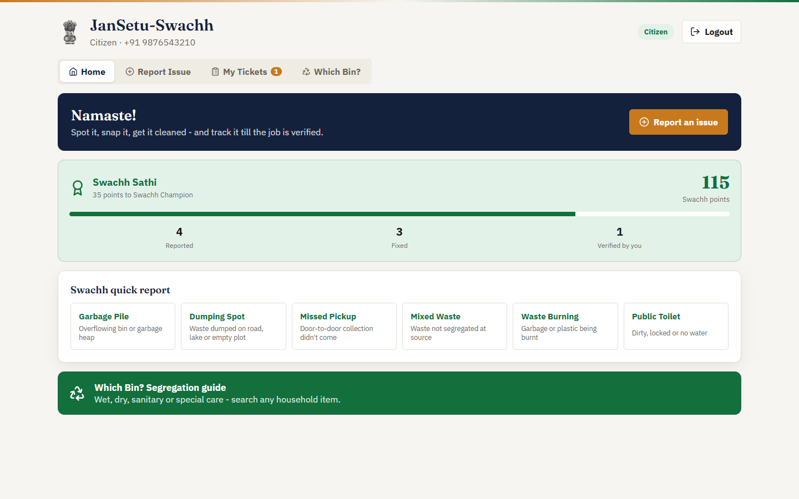 | 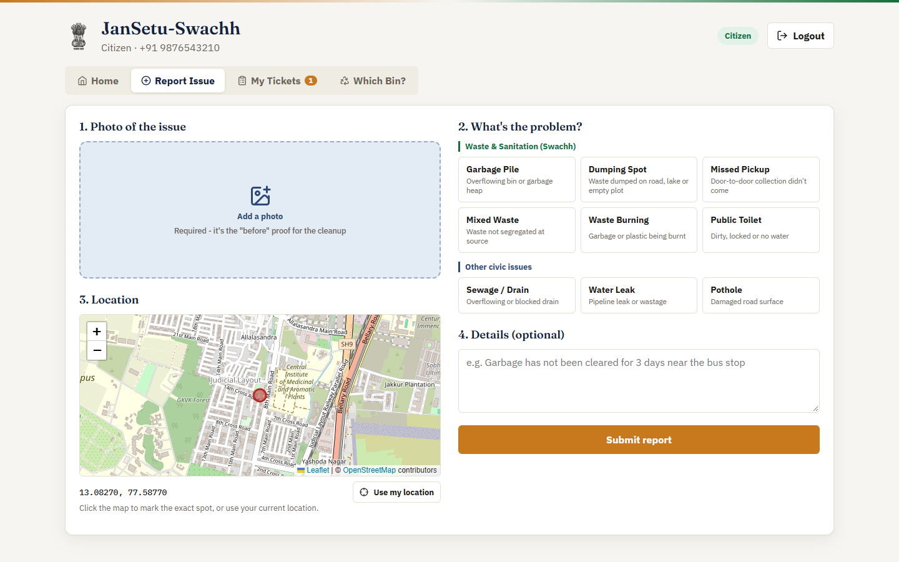 |
| **My tickets (confirm the fix)** | **Which Bin? segregation guide** |
| 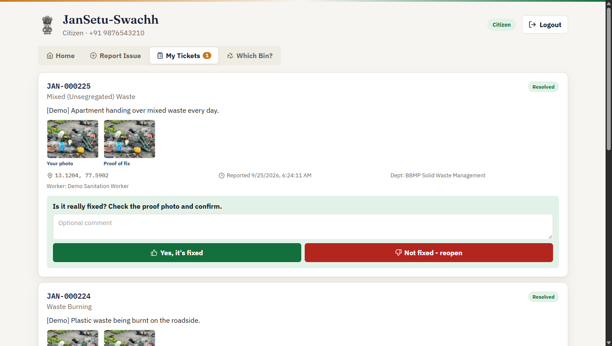 | 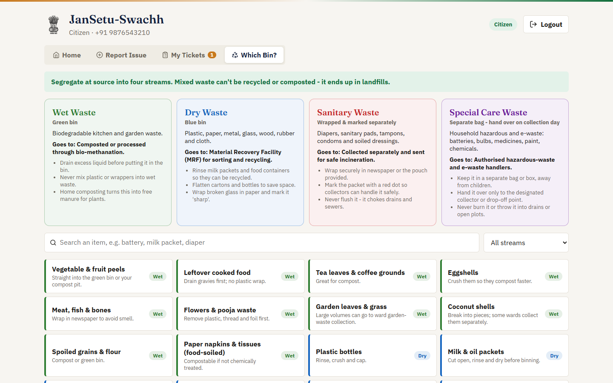 |
| **Worker: assigned tickets** | **Worker: door-to-door collection** |
| 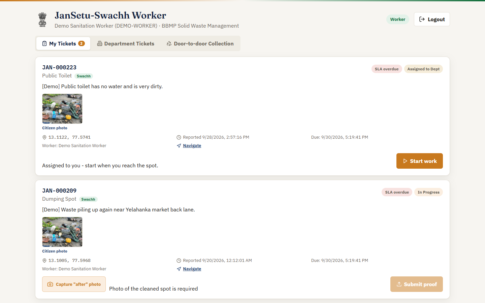 | 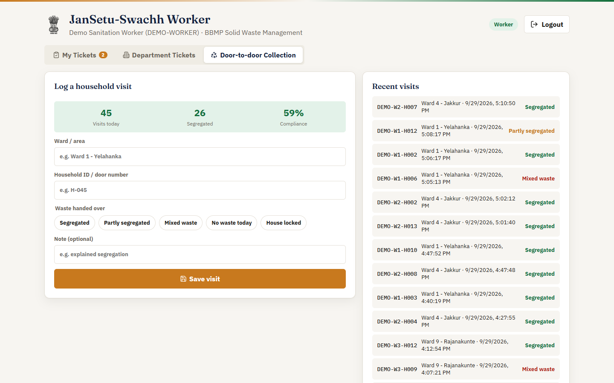 |
| **Admin: ticket queue** | **Login on a phone** |
| 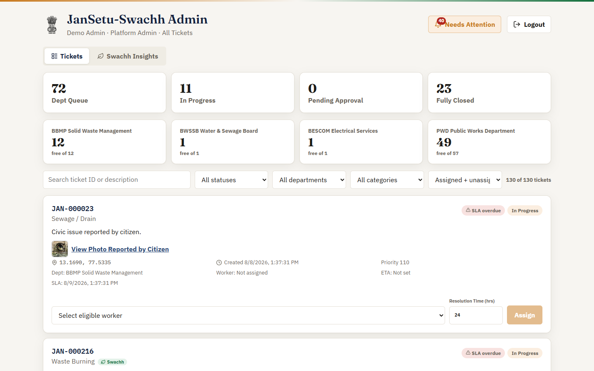 | 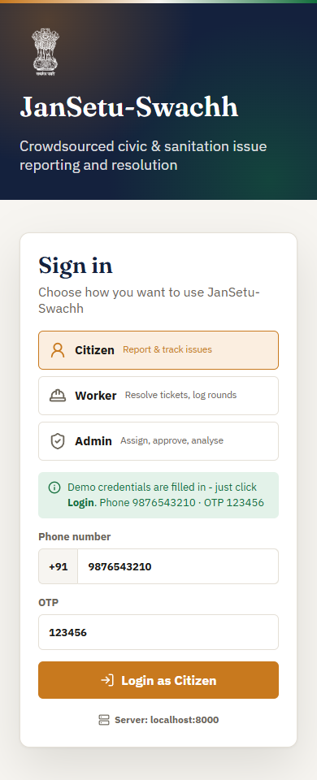 |

<details>
<summary><b>Admin: Swachh Insights (full page)</b></summary>

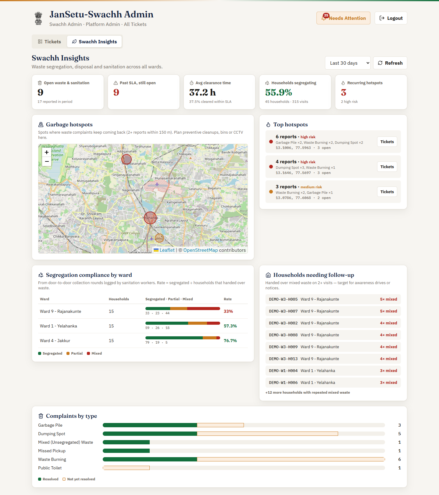

</details>

## Architecture

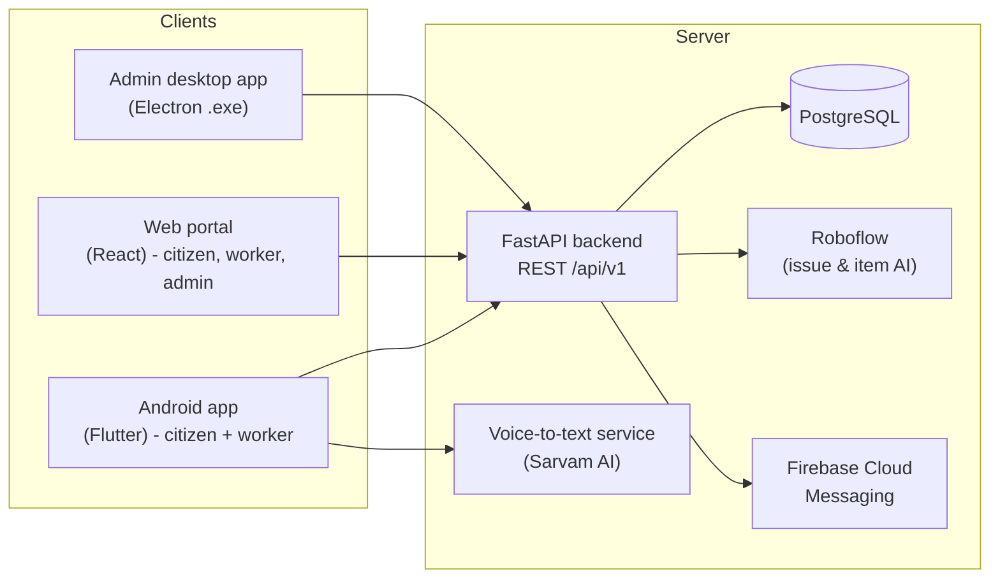

| Layer | Stack |
|---|---|
| Backend | Python 3.11, FastAPI, SQLAlchemy, PostgreSQL, Roboflow inference SDK, Firebase Admin |
| Web portal | React 18, Vite, Leaflet / OpenStreetMap, lucide-react, plain CSS |
| Mobile | Flutter 3, Riverpod, go_router, Dio, geolocator, image_picker |
| Desktop | Electron (portable Windows exe wrapping the web portal) |
| Voice | FastAPI service wrapping Sarvam AI speech-to-text (22 Indian languages → English) |

On a local network the apps find the backend automatically (UDP discovery on port 45678, with a subnet scan fallback); every app also has a **Server address** setting.

## Repository structure

```
JanSetu-Swachh/
├── backend/              FastAPI API - models, routing, SLA, Swachh endpoints, demo seeders, tests
│   ├── app/api/          auth, reports, admin (workers), ai, departments, swachh
│   ├── app/services/     routing, SLA, scoring, waste guide, discovery, demo accounts
│   ├── scripts/          reset_demo_data.py, seed_swachh_demo.py
│   └── tests/            pytest suite
├── dashboard/            Web portal (React + Vite)
│   └── src/
│       ├── portal/       unified login (citizen / worker / admin)
│       ├── citizen/      report, my tickets, Which Bin?
│       ├── worker/       tickets, proof upload, collection round
│       ├── admin/        ticket queue, Swachh Insights
│       └── components/, lib/, api/
├── mobile/               Flutter Android app (citizen + worker)
├── admin_desktop/        Electron wrapper -> portable Windows exe
├── voice-backend/        Speech-to-text microservice
├── dashboard_demo/       Department-scoped demo dashboards (PWD / water / waste)
├── mobile_demo/          Earlier single-department (waste) Flutter build
├── ml/                   ML notes
├── docs/                 Project context, spec, screenshots
└── Start-JanSetu-Server.bat   One-click LAN server start (Windows)
```

## Getting started

### Prerequisites
- Python 3.11+, Node.js 18+, PostgreSQL 14+ (with PostGIS), Flutter 3.x (for the Android app)

### 1. Backend

```powershell
cd backend
python -m venv venv
.\venv\Scripts\pip install -r requirements.txt
copy .env.example .env        # set DATABASE_URL (and optional AI keys)
.\venv\Scripts\python -m uvicorn app.main:app --host 0.0.0.0 --port 8000
```

Tables and seed departments are created on first start. API docs: http://localhost:8000/docs

**On Windows, for phones/other PCs on the same Wi-Fi**, double-click `Start-JanSetu-Server.bat` instead — it checks PostgreSQL, opens the firewall ports (when run as Administrator), starts the voice service and prints the address to use.

### 2. Web portal (citizen, worker, admin)

```powershell
cd dashboard
npm install
npm run dev            # http://localhost:5173
```

Set `VITE_API_BASE_URL` at build time to point the portal at a remote backend, or use the **Server:** link on the login page.

### 3. Android app

```powershell
cd mobile
flutter pub get
flutter run --dart-define=JANSETU_API_BASE_URL=http://<backend-ip>:8000/api/v1
flutter build apk --release --dart-define=JANSETU_API_BASE_URL=http://<backend-ip>:8000/api/v1
```

### 4. Admin desktop app (Windows)

```powershell
cd admin_desktop
npm install
npm run dist           # -> admin_desktop/release/JanSetu-Swachh-Admin-<version>.exe
```

### Deploying online

Free-tier cloud deployment (Neon database, Render backend via `render.yaml`, Netlify web portal via `dashboard/netlify.toml`) is described step by step in [docs/DEPLOYMENT.md](docs/DEPLOYMENT.md). Photos are stored in the database (`MEDIA_STORAGE=db`) so they survive Render's ephemeral disk.

### Optional services
- **Voice notes:** `voice-backend/` (port 8001) needs `SARVAM_API_KEY`.
- **AI issue detection:** Roboflow keys in `backend/.env` (see `.env.example`).
- **"Which Bin?" item scan:** `ROBOFLOW_WASTE_ITEM_MODEL_ID` — without it the guide works from search.
- **Push notifications:** Firebase service-account path in `backend/.env`.

## Downloads

Prebuilt binaries are attached to the [Releases](../../releases) page:

| File | For |
|---|---|
| `JanSetu-Swachh.apk` | Citizens and sanitation workers (Android) |
| `JanSetu-Swachh-Admin-<version>.exe` | Admins (Windows, portable - no install) |

Both connect to a JanSetu-Swachh backend: on the same Wi-Fi they find it automatically, otherwise set its address from the login screen.

## API overview

| Area | Endpoints |
|---|---|
| Auth | `POST /auth/request-otp`, `POST /auth/verify-otp` |
| Reports | `POST /reports/`, `GET /reports/?user_id=`, `POST /reports/{id}/feedback`, `POST /reports/{id}/cancel`, `POST /reports/upload-photo` |
| AI | `POST /ai/analyze-issue` |
| Workers & admin | `POST /admin/login`, `POST /admin/reports/{id}/assign`, `/start`, `/resolve`, `/approve`, `/reject` |
| Swachh | `GET /swachh/waste-guide`, `POST /swachh/classify-item`, `POST /swachh/collections`, `GET /swachh/collections`, `GET /swachh/segregation-stats`, `GET /swachh/hotspots`, `GET /swachh/summary`, `GET /swachh/citizens/{id}/impact` |

All paths are under `/api/v1`. Full interactive docs at `/docs` on a running backend.

## Testing

```powershell
cd backend;  .\venv\Scripts\python -m pytest -q     # API tests (need the PostgreSQL in .env)
cd mobile;   flutter analyze; flutter test
cd dashboard; npm run build
```

## Team

**Team JanSetu** · Presidency University, Bengaluru · Team Lead: Priyanshu Choudhary
